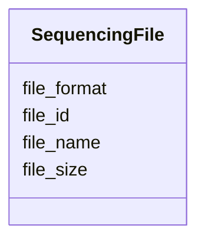

# Class: SequencingFile


_A file containing sequencing data._


URI: [https://humanpangenome.org/hprc-data-explorer/:SequencingFile](https://humanpangenome.org/hprc-data-explorer/:SequencingFile)





<!-- no inheritance hierarchy -->


## Slots

| Name | Cardinality and Range | Description | Inheritance |
| ---  | --- | --- | --- |
| [file_id](file_id.md) | 1 <br/> [String](String.md) | A unique identifier for the file | direct |
| [file_name](file_name.md) | 0..1 <br/> [String](String.md) | The name of the file | direct |
| [file_size](file_size.md) | 0..1 <br/> [Integer](Integer.md) | Size of file in megabytes | direct |
| [file_format](file_format.md) | 0..1 <br/> [String](String.md) | An indication of the format of an electronic file; include the full file exte... | direct |


## Identifier and Mapping Information


### Schema Source


* from schema: https://humanpangenome.org/hprc-data-explorer


## Mappings

| Mapping Type | Mapped Value |
| ---  | ---  |
| self | https://humanpangenome.org/hprc-data-explorer/:SequencingFile |
| native | https://humanpangenome.org/hprc-data-explorer/:SequencingFile |


## LinkML Source

<!-- TODO: investigate https://stackoverflow.com/questions/37606292/how-to-create-tabbed-code-blocks-in-mkdocs-or-sphinx -->

### Direct

<details>
```yaml
name: SequencingFile
description: A file containing sequencing data.
from_schema: https://humanpangenome.org/hprc-data-explorer
slots:
- file_id
- file_name
- file_size
- file_format

```
</details>

### Induced

<details>
```yaml
name: SequencingFile
description: A file containing sequencing data.
from_schema: https://humanpangenome.org/hprc-data-explorer
attributes:
  file_id:
    name: file_id
    description: A unique identifier for the file.
    from_schema: https://humanpangenome.org/hprc-data-explorer
    rank: 1000
    identifier: true
    alias: file_id
    owner: SequencingFile
    domain_of:
    - SequencingFile
    range: string
    inlined: true
  file_name:
    name: file_name
    description: The name of the file.
    from_schema: https://humanpangenome.org/hprc-data-explorer
    rank: 1000
    alias: file_name
    owner: SequencingFile
    domain_of:
    - SequencingFile
    range: string
  file_size:
    name: file_size
    description: Size of file in megabytes.
    from_schema: https://humanpangenome.org/hprc-data-explorer
    rank: 1000
    alias: file_size
    owner: SequencingFile
    domain_of:
    - SequencingFile
    range: integer
  file_format:
    name: file_format
    description: An indication of the format of an electronic file; include the full
      file extension including compression extensions. Usually aligns with file extension
      (e.g. bam, sam, text, csv, etc.)
    from_schema: https://humanpangenome.org/hprc-data-explorer
    rank: 1000
    alias: file_format
    owner: SequencingFile
    domain_of:
    - SequencingFile
    range: string

```
</details>